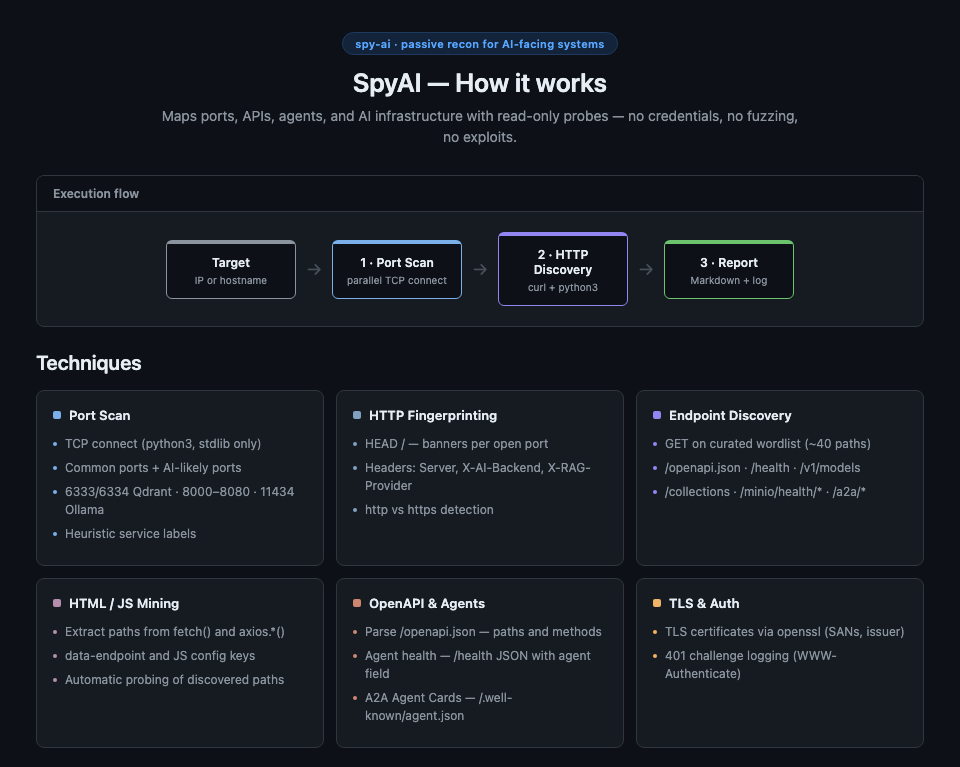

# SpyAI

**Passive reconnaissance for AI-facing systems**

SpyAI maps ports, APIs, agents, and AI infrastructure with read-only probes — no credentials, no fuzzing, no exploits. It targets the footprints typical of LLM agents, RAG backends, vector stores, and adjacent infrastructure, then produces a Markdown report plus a full execution log.

<p align="center">
  
</p>

---

## Execution flow

Each run follows three phases:

| Phase | What happens |
| ----- | ------------ |
| **1 · Port Scan** | Parallel TCP connect (`python3`, stdlib) on common ports plus AI-likely ports |
| **2 · HTTP Discovery** | Fingerprinting, endpoint probing, HTML/JS mining, OpenAPI and agent parsing |
| **3 · Report** | Structured Markdown report and full execution log under `output/` |

---

## Techniques

### Port Scan

- TCP connect (`python3`, stdlib only — no nmap required)
- Common ports + AI-likely ports: 6333/6334 Qdrant, 8000–8080, 11434 Ollama, 5601, 5678/n8n, 9000, 9200, etc.
- Heuristic service labels in the report (port-based; use nmap separately for `-sV`)

### HTTP Fingerprinting

- `HEAD /` banners per HTTP-likely open port
- Interesting headers: `Server`, `X-AI-Backend`, `X-RAG-Provider`, `X-Model`, `X-Inference-Engine`
- Automatic http vs https scheme detection

### Endpoint Discovery

- `GET` on a curated wordlist (~40 paths) from `data/passive_probes.txt`
- AI-relevant paths: `/openapi.json`, `/health`, `/v1/models`, `/api/chat`, `/collections`, `/minio/health/*`, `/a2a/*`

### HTML / JS Mining

- Extracts embedded API paths from `fetch()`, `axios.*()`, `data-endpoint`, and JS config keys (`apiBase`, `endpoint`) on `/`
- Automatically probes any newly discovered paths

### OpenAPI & Agents

- Parses `/openapi.json` — lists paths, methods, and summaries when status is 200
- **Agent health** — detects uvicorn-style `/health` JSON with an `agent` field (ports 8000–8080)
- **A2A Agent Cards** — parses `/.well-known/agent.json` (name, description, skills, service endpoint)

### TLS & Auth

- TLS certificate mining via `openssl` — subject, issuer, dates, SANs (optional)
- Logs `401` responses with `WWW-Authenticate` challenges

---

## Dependencies

| Tool | Required | Enables |
| ---- | -------- | ------- |
| `python3` | Yes | TCP port scan, OpenAPI/HTML parsing, agent `/health` JSON |
| `curl` | Yes | `HEAD` / `GET` HTTP probes |
| `openssl` | No | TLS certificate mining |
| `timeout` / `gtimeout` | No | Bounds TLS handshake (macOS: `brew install coreutils`) |

**Not required:** `nmap`. Use it separately for broader port coverage or version probes.

---

## Install

```bash
git clone https://github.com/jmessiass/spy-ai.git
cd spy-ai
chmod +x spy-ai lib/scan_ports.py
```

## Usage

```bash
./spy-ai 192.168.1.10
./spy-ai api.example.com
./spy-ai --help
```

The target may be an IPv4 address or a hostname (FQDN).

## Project layout

```
spy-ai/
├── spy-ai                          # main script
├── spy-ai-overview.png             # visual overview diagram
├── lib/
│   └── scan_ports.py               # parallel TCP connect scanner
├── data/
│   ├── passive_probes.txt          # HTTP path wordlist
│   └── interesting_headers.txt     # headers echoed in exec log
└── output/
    ├── <target>-N.md
    └── logs/
        └── <target>-N.exec.log
```

### Sample report excerpt

```markdown
## Open Ports
| Port | Service |
| ---- | ------- |
| 8030 | http |

## HTTP Banners (HEAD /)
| Port | Scheme | Status | Server | Content-Type | Location |

## Discovered Endpoints
### Port 8030 (http)
| Path | Status | Content-Type | Size | Notes |
| /openapi.json | 200 | application/json | 1234 | |
| /health | 200 | application/json | 89 | |
| /collections | 200 | application/json | 60 | body={"result":{"collections":[]},...} |
```

## Customization

Edit wordlists in `data/` (one entry per line; `#` comments allowed):

- **`passive_probes.txt`** — HTTP paths to `GET` on each open HTTP-likely port
- **`interesting_headers.txt`** — response headers echoed in the execution log

To add ports to the TCP scan, edit `COMMON_PORTS` or `HTTP_LIKELY_PORTS` in `spy-ai`, or extend `SERVICE_HINTS` in `lib/scan_ports.py` for report labels.

## Passive vs active

> SpyAI does **not** send credentials or exploit payloads. From the application's perspective it is passive (read-only probes). It still generates **active network traffic** (TCP connect + `curl`) — use only on systems you are authorized to test.

## Legal

Unauthorized scanning may violate law or policy. You are responsible for obtaining permission before running SpyAI against any target.

## License

MIT — see [LICENSE](LICENSE).
